# Welcome to my Ubuntu-Server 24.04.2 LTS HomeLab

## Table of Contents

  - [Introduction](#intro)
  - [Inital Setup](#initial)
  - [Installing Samba](#samba)
  - [Installing NFS](#nfs)
  - [Installing MariaDB](#maria)
  - [Installing Apache2](#apache)
  - [My Favorite Part. Installing an SSD](#ssd)
  - [Virtualization KVM & QEMU](#virtual)
  - [Securing OpenSSH-Server](#ssh)
  - [Summary](#summary)

## <a name="intro"></a>Intro: The Home-Labtop
I turned my old gaming laptop into an Ubuntu server for practice. I've been using Linux for a over a year now starting back with VM's in Virtual Box. I eventually upgraded to downloading an ISO with a USB stick and putting Linux Mint on both my laptops and dual booting my desktop. Then I took my stab at Linux+ and passed. Now while I don't care much for the certification I did learn a lot more about Linux in the process of studying for it. I then bought book about Ubuntu server and learned even more to add to my previous studying. And that is what brought me here. Finally testing some of what I had learned. I don't have fancy hardware for this home lab.. yet. I used this as more of a test. This setup I have is very temporary while I look into a more long-term solution as I continue to learn and figure out what I am after. So far I setup Samba, NFS, MariaDB, and Apache2 with my own web page that I made for guests to visit when connected to our WiFi. I then installed a new SSD and partitioned it with the fdisk utility. Finally, I try my hand at some virtualization. I had a lot of fun with this and plan on doing more in the future. 

## <a name="initial"></a>Initial Setup
I downloaded the Ubuntu server ISO to my USB stick and wiped the drive. The setup was very easy and straight forward. I used DHCP for the inital network interface setup, but used my routers web interface to set the server to a static IP. Now I can login and get started.

**First commands:**

```shell
# First I update the system
$ sudo apt update && sudo apt full-upgrade
$ sudo reboot now
# I then install what I can think of off the top of my head especially Vim
$ sudo apt install vim build-essential vlock htop tree
$ sudo ufw enable
# Don't forget to edit firewall rules for added services!
```
***HTOP is one of those tools that looks really confusing when you see it for the very first time. Once you start to learn to read it though, it really is an awesome tool:***
<p align="center">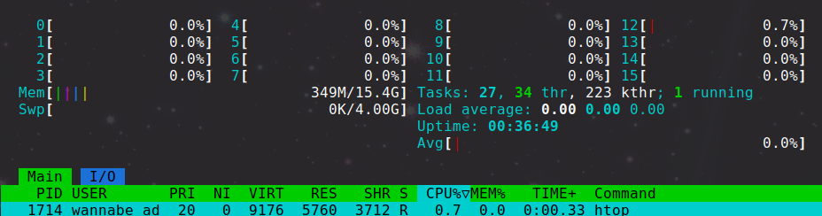</p>

***I then create my .vimrc file with my personal preferences and copy it to the /etc/skel directory, so when I create a new user they also get that file. Openssh-server was installed initially so now it's time to sit comfortably at my desktop and SSH in.***

***SSH:***

```shell
# I edit the /etc/banner and edit /etc/ssh/sshd_config file to allow a banner so I can add my own custom one
# Adding servers hostname to hosts file
$ sudo echo -e "192.168.x.x\tubuntu-home-server" >> /etc/hosts
# Creating an alias for the ssh command
$ echo 'alias server="ssh wannabe_admin@ubuntu-home-server"' >> .bashrc
# Generating keys for pub key auth
$ ssh-keygen
# Copying public key to server
$ ssh-copy-id wannabe_admin@ubuntu-home-server

```

<p align="center">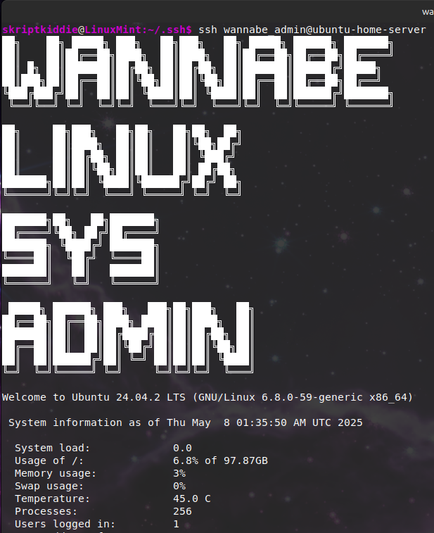</p>

***Fixing the timezone:***

```shell
$ timedatectl
# timezone is ahead about 4 hours and this will abviously mess up any cron jobs
$ timedatectl list-timezones | grep Los
$ sudo timedatectl set-timezone America/Los_Angeles
# That fixed it
```

***Adding my first unprivileged user:***

```shell
$ sudo useradd -m -d /home/cartier -c "Hunter Cartier" -s /bin/bash cartier
$ tail -1 /etc/passwd
cartier:x:1001:1001:Hunter Cartier:/home/cartier:/bin/bash
$ sudo passwd cartier
New password: 
Retype new password: 
passwd: password updated successfully
```

***I decided to create a simple cronjob just cause***
<p align="center">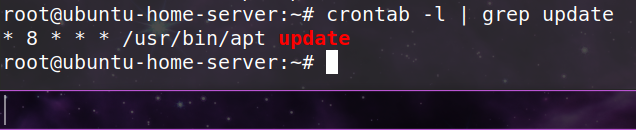</p>

***Now time to install services. Ubuntu starts services when they're installed, so after editing the config files I usually just run "sudo systemctl restart/reload \<service\>"***

## <a name="samba"></a>Installing Samba
I set up a samba share as I have one windows pc and it may come in handy related to school projects and transferring files.

```shell
$ sudo apt install samba

# running testparm against my config file and it returns this:
$ testparm /etc/samba/smb.conf
Load smb config files from /etc/samba/smb.conf
Loaded services file OK.
# A simple configuration file to get started:

# Global parameters
[global]
	map to guest = Bad User
	name resolve order = host bcast wins
	security = USER
	server string = File Server
	idmap config * : backend = tdb
	include = /etc/samba/smbshared.conf


[Documents]
	force group = users
	force user = cartier
	guest ok = Yes
	path = /share/documents


[Public]
	create mask = 0664
	directory mask = 0777
	force create mode = 0644
	force directory mode = 0777
	force group = users
	force user = cartier
	guest ok = Yes
	path = /share/public
	read only = No

# creating the directory shares
$ sudo mkdir -p /share/documents 
$ sudo mkdir /share/public
$ sudo chown -R cartier:users /share
$ sudo systemctl start smbd

# testing that I can access the share from my desktop
$ smbclient //ubuntu-home-server/documents -U cartier
```
<p align="center">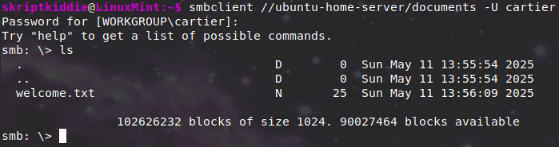</p>

## <a name="nfs"></a>Installing NFS
I know I already have a Samba share, but I still wanted to do this for the practice. 

```shell
# On server: 
$ man exports # documentation
# Creating directories for the shares. Each share in NFS is known as an export
$ sudo mkdir -p /exports/backup
$ sudo mkdir /exports/documents
$ sudo mkdir /exports/public
$ sudo apt install nfs-kernel-server

# Creating the exports file
$ cat /etc/exports
/exports *(ro,fsid=0,no_subtree_check)
/exports/backup 192.168.0.1/255.255.255.0(rw,no_subtree_check)
/exports/documents 192.168.0.1/255.255.255.0(ro,no_subtree_check)
/exports/public 192.168.0.1/255.255.255.0(rw,no_subtree_check)

# From client:
$ sudo apt update && sudo apt install nfs-common
$ sudo mkdir /mnt/documents
$ sudo mount 192.168.0.231:/documents /mnt/documents
# checking share contents 
$ ls /mnt/documents
nfs_share.txt
```
<p align="center">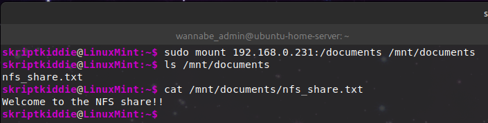</p>

## <a name="maria"></a>Installing MariaDB
I also setup MariaDB although I don't do much with it. It was still fun. 

```shell
$ sudo apt install mariadb-server
# run security script
$ sudo mysql_secure_installation
$ sudo mariadb #enter db shell
# Create admin acc
$ CREATE USER 'admin'@'localhost' IDENTIFIED BY '<password>';
$ GRANT SELECT ON *.* TO 'readonlyuser'@'localhost' IDENTIFIED BY '<password>';
$ GRANT ALL PRIVILEGES ON *.* TO 'admin'@'localhost';
$ FLUSH PRIVILEGES;
$ exit
$ mariadb -u admin -p
$ CREATE DATABASE mysampledb;
$ USE mysampledb;
$ SHOW DATABASES;
$ SELECT HOST, USER, PASSWORD FROM mysql.user;
$ CREATE TABLE Employees (Name char(20), Age int(3), Occupation char(20));
$ SHOW COLUMNS IN Employees;
$ INSERT INTO Employees VALUES ('Elliot Alderson', '25', 'Sec Engineer');
$ SELECT * FROM Employees;
```
<p align="center">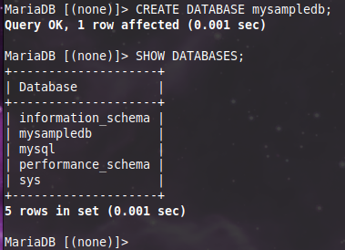</p>
<p align="center">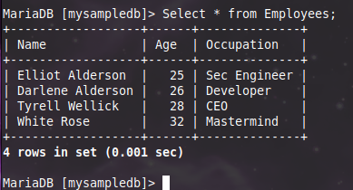</p>

## <a name="apache"></a>Installing Apache2
This was probably the easiest one and the most fun to setup. It was fun because I know some simple web development and was able to create and host my own website for guests to see when they come over and connect to the wifi.

```shell
$ sudo apt install apache2
$ sudo mv /var/www/html/index.html /var/www/html/index.orig
$ sudo cp cartierHomePage.tar.gz /var/www/html/
$ sudo tar -xzvf cartierHomePage.tar.gz
# in this tarball I have my own index.html page to host a web page I created
$ sudo systemctl reload apache2
```
<p align="center"></p>

## <a name="ssd"></a>My Favorite Part. Installing an SSD
For this I bought a $20 256GB NVMe M.2 PCIe 2280 SSD all for the sole purpose of installing and partitioning the new drive. You gotta learn somehow..

<p align="center">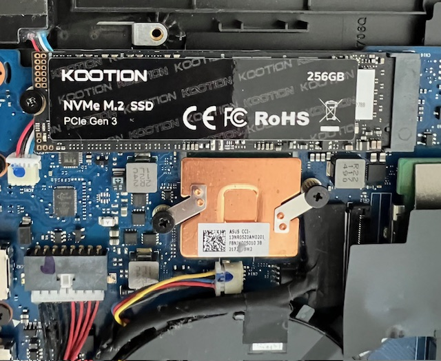</p>

***Creating a GPT partition:***

```shell
# Listing block devices:
$ lsblk 
$ sudo fdisk -l 
$ sudo fdisk /dev/nvme1n1
# creating GPT partition:
  Command (m for help): g
  Created a new GPT disklabel
  Command (m for help): n
  Partition number (1-128, default 1): 
  First sector (2048-500118158, default 2048): 
  Last sector, +/-sectors or +/-size{K,M,G,T,P} (2048-500118158, default 500117503): 

  Created a new partition 1 of type 'Linux filesystem' and of size 238.5 GiB.
# Writing changes to the drive
  Command (m for help): w
  The partition table has been altered.
  Calling ioctl() to re-read partition table.
  Syncing disks.
```
<p align="center">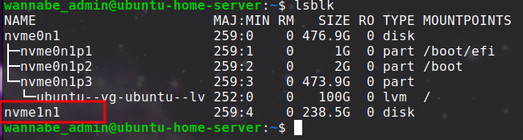</p>

***Formatting Partition***

```shell
$ sudo mkfs.ext4 /dev/nvme1n1p1
  mke2fs 1.47.0 (5-Feb-2023)
  Discarding device blocks: done                            
  Creating filesystem with 62514432 4k blocks and 15630336 inodes
  Filesystem UUID: 5eef5737-258c-4d35-a0f0-a153174d05f5
  Superblock backups stored on blocks: 
	  32768, 98304, 163840, 229376, 294912, 819200, 884736, 1605632, 2654208, 
	  4096000, 7962624, 11239424, 20480000, 23887872

  Allocating group tables: done                            
  Writing inode tables: done                            
  Creating journal (262144 blocks): done
  Writing superblocks and filesystem accounting information: done
```

<p align="center">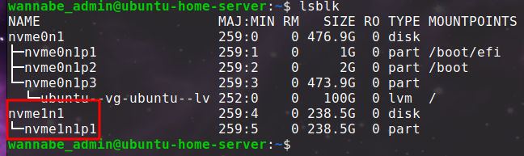</p>

***Adding Drive to /etc/fstab***

Be careful editing this file. Edit this file to add additional volumes to be mounted at boot time. However, this file also mounts your main file system, so one mistake and you're not booting. 

```shell
# Creating mount point
$ sudo mkdir /mnt/vol1
# Getting UUID for fstab file
$ sudo blkid
$ sudo vim /etc/fstab
$ tail -2 /etc/fstab
  # Extra Storage
  UUID=5eef5737-258c-4d35-a0f0-a153174d05f5 /mnt/vol1 ext4 defaults 0 0
```
***Looks like I was able to reboot!***

<p align="center"></p>

## <a name="virtual"></a>Virtualization KVM & QEMU

Kernel-based VM and Quick Emulator allow Linux to use virtualization without third party solutions, such as VirtualBox.

```shell
$ sudo apt install bridge-utils libvirt-clients libvirt-daemon-system qemu-system-x86 
$ sudo systemctl stop libvirtd
# These groups were autocreated, but our user was only added to libvert
# So we will add user to kvm group
$ cat /etc/group | grep kvm
$ cat /etc/group | grep libvirt
$ sudo usermod -aG kvm wannabe_admin
# kvm group will need access to where our ISO images will be stored
$ sudo chown :kvm /var/lib/libvirt/images/ISO
$ sudo chmod g+rw /var/lib/libvirt/images/ISO
$ sudo systemctl start libvirtd
$ sudo systemctl status libvirtd

# Carefully editing the configuration file for our network interfaces to add a bridge
# This will allow all our network devices to talk to the virtual machine
# not best practice as usually the point of vm's is to be isolated but I have never done it before so i wanted to try
$ sudo cat /etc/netplan/50-cloud-init.yaml
[sudo] password for wannabe_admin: 
network:
  version: 2
  renderer: networkd
  ethernets:
    enp3s0:
      dhcp4: false
  bridges:
    br0:
      interfaces: [enp3s0]
      dhcp4: true
      parameters:
        stp: false
        forward-delay: 0
 # Rebooting the server
 $ sudo reboot now
```

<p align="center">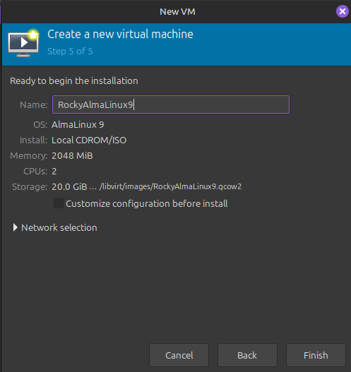</p>

***Back on my desktop with GUI:***

```shell
# Installing virtual machine manager for GUI
$ sudo apt install ssh-askpass virt-manager
# Install an ISO. I went with Rocky Linux Minimal ISO
$ scp Rocky-9.5-x86_64-minimal.iso wannabe_admin@ubuntu-home-server:
# Then on the server I cp the ISO to the /var/lib/libvirt/images/ISO directory
```

***After running through the setup process with virtual machine manager I have a running VM on my server:***

<p align="center">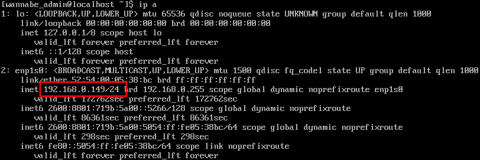</p>

***Managing Virtual Machines from the Command Line:***

```shell
$ virsh list --all
 Id   Name              State
---------------------------------
-    RockyAlmaLinux9   shut off

$ virsh start RockyAlmaLinux9
Domain 'RockyAlmaLinux9' started

$ virsh list
 Id   Name              State
---------------------------------
 1    RockyAlmaLinux9   running

$ virsh shutdown RockyAlmaLinux9
Domain 'RockyAlmaLinux9' is being shutdown
```

## <a name="ssh"></a>Securing OpenSSH-Server

The more services you are running the larger your attack surface. This server is a temporary test server used for practicing until I purchase a more serious and long-term solution. I would never allow this server open to the public internet through something such as port fowarding. This server does have some security by default as it sits behind my router. Here I practice a few ways of securing SSH.

```shell
$ man sshd_config
# openssh log attempts:
$ tail -20 /var/log/auth.log
# Editing /etc/ssh/sshd_config:
# Default allows ssh keys but not passwd for root login. No means no remote login at all
PermitRootLogin no
PasswordAuthentication no
AllowGroups sshusers
# Could also change default port from 22 as that is a common port that bots may scan
# My ssh-server is not publicly facing the internet so I will leave it

$ sudo apt update && sudo apt install fail2ban
# jail.local overwrites jail.conf and jail.conf could also be overwritten during updates
$ sudo cp /etc/fail2ban/jail.conf /etc/fail2ban/jail.local
# edit jail.local
```

## <a name="summary"></a>Summary

I turned an old gaming laptop into a home server running Ubuntu 24.04.2 LTS just to mess around and learn more about Linux. I’ve been using Linux for over a year now and wanted to put what I’ve learned into action. In this project, I set up Samba, NFS, MariaDB, Apache2 (with a custom web page), and even installed a new SSD just for the fun of partitioning and formatting it. Then I tried out virtualization which required a lot more setup than VirtualBox. Everything’s still a work in progress, but it’s been a great learning experience so far. More to come!
